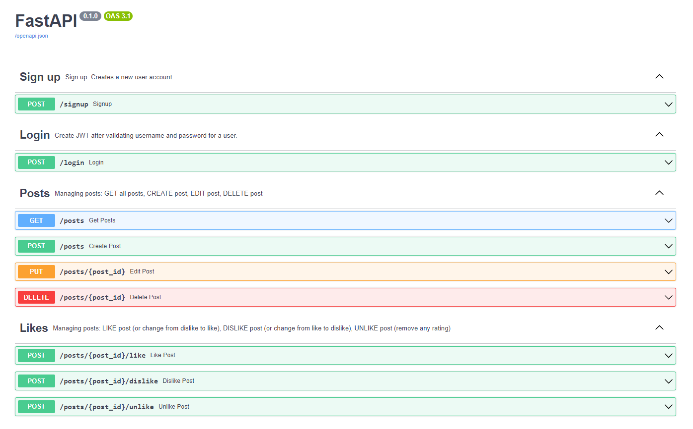

# Simple RESTful API using FastAPI for a social networking application

Требуется установить все зависимости из "requirements.txt"   
* _(pip install -r requirements.txt)_
___
## Описание

### 1. БД 
> Выбор базы данных — достаточно SQLite3
### 2. Реализация сервиса
> Сервис реализован в виде RESTful API с FastAPI
#### Вся документация находится на главной странице приложения
### 3. Запуск
> 1. Установить все библиотеки из requirements.txt
> 2. Запустить приложение командой _uvicorn main:app --reload_
> 3. Если запущен локально, то зайти по ссылке http://127.0.0.1:8000, где будет вся документация
> 4. Можно тестировать
### 4. Скрин документации

### 5. Примечания
> * Файл с базой данных создастся автоматически
> * Нельзя поставить лайк и дизлайк посту одновременно - они будут сменяться друг на друга 
> * Можно убрать оценку
> * Одному пользователю нельзя поставить оценку на один пост несколько раз

